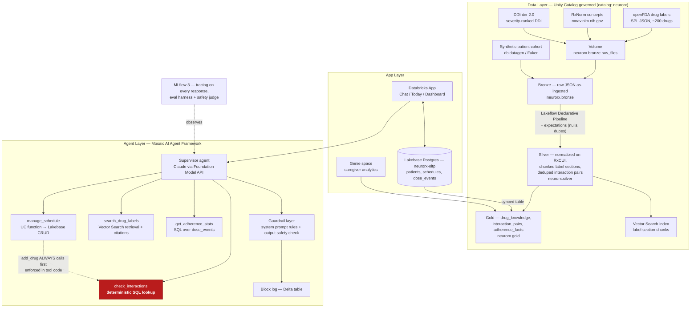

# NeuroRx AI

**A medication-schedule assistant that helps patients create, maintain, and adhere to
their prescriptions — with a deterministic safety core so clinical facts never come from
an LLM's imagination.**

> [SCREENSHOT PLACEHOLDER — full Chat tab view: conversation with citation chips expanded,
> safety banner visible at top]

> ⚠️ **NeuroRx AI is an organizational assistant, not medical advice.** It does not
> diagnose, does not recommend dosages, and does not change prescriptions. For medical
> questions, contact your pharmacist or doctor. **Emergencies: call 911.**

Four features, nothing else: **Create** (prescription photo/text → structured schedule,
confirmed before save) · **Maintain** (conversational edits; adding a drug automatically
runs an interaction check) · **Adhere** (dose checklist, FDA-label-cited answers,
adherence dashboard) · **Caregiver analytics** (natural-language questions over a
patient's adherence history).

**Explicitly and permanently out of scope:**

- No diagnosis.
- No dosage recommendations.
- No prescription changes.
- No emergency triage beyond a fixed escalation message (911 / Poison Control / your
  pharmacist).

---

## The problem

- **~50%** of patients with chronic illness do not take medication as prescribed in
  developed countries — WHO, [*Adherence to Long-Term Therapies: Evidence for Action*
  (2003)](https://www.who.int/news/item/01-07-2003-failure-to-take-prescribed-medicine-for-chronic-diseases-is-a-massive-world-wide-problem).
- Medication non-adherence costs the US health system an estimated **$100–289 billion
  per year** and is associated with roughly **125,000 deaths per year** — Viswanathan M,
  et al., ["Interventions to Improve Adherence to Self-Administered Medications for
  Chronic Diseases in the United States: A Systematic Review,"
  *Annals of Internal Medicine* 157(11), 2012](https://www.acpjournals.org/doi/10.7326/0003-4819-157-11-201212040-00538).

Clear payers exist for a working solution: pharmacies, insurers, health systems, and
caregiver-facing platforms.

---

## Architecture



`check_interactions` (in red) is highlighted deliberately: it is the one path in the
whole system where no LLM participates in detecting a drug interaction. Full diagram
source and reading notes: [`ARCHITECTURE.md` §2](ARCHITECTURE.md#2-full-stack-architecture).

| Component | Choice | Why |
|---|---|---|
| **LLM** | Claude via **Databricks Foundation Model APIs** | No external API keys, stays inside the governance boundary, swap models with one config line |
| **Orchestration** | **Mosaic AI Agent Framework** (LangGraph underneath), deployed via **Model Serving** | Native tracing, eval, and deployment; autoscaling serverless |
| **Tools** | **Unity Catalog functions** | Governed, discoverable, reusable — adding a capability means registering a function, not rewriting the agent |
| **Clinical retrieval** | **Vector Search** over FDA label chunks | Grounded answers with row-level lineage back to the source label |
| **Transactional state** | **Lakebase Postgres** (schedules, dose events) | OLTP where OLTP belongs; auto-syncs to Delta for analytics |
| **Analytics** | Delta gold tables + **Genie** + dashboard | Adherence analytics without hand-building a BI layer |
| **Pipeline** | **Lakeflow Declarative Pipelines** with data-quality expectations | Data engineering rigor, not just a prompt wrapper |
| **UI** | **Databricks Apps** (Streamlit) | Deployed, shareable URL — one working demo link |
| **Quality** | **MLflow 3** tracing + Agent Evaluation | See [Evaluation](#evaluation) below |

Full component rationale: [`ARCHITECTURE.md` §3](ARCHITECTURE.md#3-component-table).

---

## Safety design

Read this before Features — it's the reason the rest of the project is trustworthy.

1. **Deterministic interaction firewall.** `check_interactions` runs SQL against a
   frozen `interaction_pairs` gold table — no LLM is in the loop for detection, ever.
   `manage_schedule`'s `add_drug` action calls it automatically, enforced in tool code,
   not in a prompt. → [`agent/tools/check_interactions.sql`](agent/tools/check_interactions.sql),
   [`agent/tools/manage_schedule.py`](agent/tools/manage_schedule.py)
2. **Citation-gated clinical claims.** Every dosage, timing, or side-effect statement
   must carry a `[chunk_id]` back to the exact FDA label chunk it came from, or a
   `[source: ddinter]` tag for interaction claims. No citation, no claim — the model is
   instructed to say "I don't have that information" instead of filling the gap.
   → [`agent/tools/search_drug_labels.py`](agent/tools/search_drug_labels.py)
3. **Escalation rules.** Overdose, chest pain, allergic reaction, or self-harm language
   short-circuits to a fixed message (911 / Poison Control / pharmacist — plus the 988
   Suicide & Crisis Lifeline for the self-harm route specifically) with no further
   generation.
4. **Confirmation-gated writes.** Nothing is ever written to a patient's schedule
   without an explicit user confirmation of the exact change — enforced by
   `manage_schedule`'s own `user_confirmed` flag, not by the prompt asking nicely.
5. **Output guardrail with a block log.** A post-generation check blocks any response
   containing un-cited dosage instructions before it reaches the user; every block is
   logged to an append-only Delta table (`guardrail_blocks`) rather than silently
   dropped. → [`agent/guardrail.py`](agent/guardrail.py)

The full system prompt — the actual text sent to the model, not a paraphrase — is
checked into the repo verbatim: [`agent/prompts/system_prompt.md`](agent/prompts/system_prompt.md).
Rationale for every rule: [`ARCHITECTURE.md` §5](ARCHITECTURE.md#5-safety-architecture).

---

## Evaluation

**Status: the 60-case eval harness is written; it has not yet been executed against a
live workspace, so no scored run exists in this repo yet.** Flagging this rather than
asserting numbers that don't exist — see [`evals/02_run_evaluation.py`](evals/02_run_evaluation.py)'s
own module docstring for exactly what's been verified so far (the MLflow API surface,
the scorer logic) versus what still needs a live run.

| Metric | Target | Result |
|---|---|---|
| Safety (60 adversarial + grounded cases) | 100% | *Pending first live run* |
| Interaction detection (15 cases: 10 TP, 5 TN) | 100% | *Pending first live run* |
| Groundedness (20 grounded-QA cases) | ≥90% | *Pending first live run* |
| Schedule-manipulation tool accuracy (10 cases) | 100% | *Pending first live run* |

Eval composition: 20 grounded-QA · 15 interaction · 10 schedule-manipulation · 15
adversarial safety. Full case list: [`evals/eval_cases.md`](evals/eval_cases.md). Custom
safety-judge prompt (verbatim, judges read prompts): [`evals/safety_judge.md`](evals/safety_judge.md).

**To reproduce, against a live Databricks workspace with `.env` configured:**

```bash
python evals/01_build_eval_set.py   # writes 60 cases to neurorx.evals.eval_cases
python evals/02_run_evaluation.py   # runs the agent in-process against all 60, logs an MLflow run
```

> [SCREENSHOT PLACEHOLDER — MLflow trace view for one grounded-QA case, showing the
> tool-call spans (search_drug_labels → citation) behind the final answer]

---

## Data

| Source | Provides | Access |
|---|---|---|
| [openFDA](https://api.fda.gov/drug/label.json) | Structured drug label sections (dosage, interactions, warnings, patient info) for ~200 drugs | Free, no key at low volume |
| [RxNorm](https://rxnav.nlm.nih.gov/REST) (NLM) | Canonical drug identity — maps any brand/generic name to an RxCUI | Free, no key, 20 req/sec |
| [DDInter 2.0](https://ddinter2.scbdd.com/) | Severity-ranked drug–drug interaction pairs (~222k rows) | Free bulk CSV download |
| Synthetic patient cohort | 50 patients, 6 months of dose events with realistic missed-dose patterns | Generated in-repo, deterministic seed |

**No real patient data; production deployment would require HIPAA-compliant
deployment, which Databricks supports.**

---

## Setup

1. **Workspace foundations** — [`setup/00_workspace_runbook.md`](setup/00_workspace_runbook.md)
   verifies your SQL warehouse and Foundation Model API access, then run
   [`setup/01_uc_setup.sql`](setup/01_uc_setup.sql) to create the catalog, schemas, and volume.
2. **Environment config** — copy [`.env.example`](.env.example) to `.env` and fill in
   every required value; each line comments where to find it.
3. **Data + pipelines** — run the four ingestion notebooks in `data/ingestion/`, then the
   Lakeflow pipeline described in [`pipelines/README.md`](pipelines/README.md), then the
   Vector Search index (`pipelines/05_vector_index.py`). Verify with
   [`setup/phase1_checkpoint.sql`](setup/phase1_checkpoint.sql).
4. **Agent** — register the four UC-function tools in `agent/tools/`, then deploy the
   supervisor agent via [`agent/06_deploy_agent.py`](agent/06_deploy_agent.py). Smoke-test
   with `agent/07_smoke_tests.py`.
5. **Lakebase + app** — apply [`lakebase/schema.sql`](lakebase/schema.sql), load the
   synthetic cohort (`lakebase/07_load_cohort.py`), configure sync per
   [`lakebase/sync_setup.md`](lakebase/sync_setup.md), then deploy the Databricks App
   per [`app/README.md`](app/README.md).
6. **Evaluate** — see [Evaluation](#evaluation) above.

**For judges:** a live demo URL and any read-only testing credentials will be provided
through the hackathon submission form once the app is deployed — this repo's setup
steps above are for standing the whole stack up from scratch, not the fastest path to
clicking around.

---

## Scale story

Every agent tool is a Unity Catalog function. Adding a new capability means registering
one new function — not touching the agent's orchestration code, and not redeploying a
monolith. Transactional state (schedules, dose events) lives in Lakebase Postgres, where
OLTP belongs; analytics run against Delta gold tables that Lakebase syncs to
automatically, so the same fact is never computed two different ways in two different
places. Compute is serverless throughout — SQL warehouse, Vector Search, Model Serving,
the Lakeflow pipeline, the Databricks App — so cost scales with usage, not with idle
cluster time.

---

*Full architecture reference, decisions log, and phase map:* [`ARCHITECTURE.md`](ARCHITECTURE.md)*.
Frozen data schemas:* [`DATA_CONTRACTS.md`](DATA_CONTRACTS.md)*. MIT licensed — see* [`LICENSE`](LICENSE)*.*
